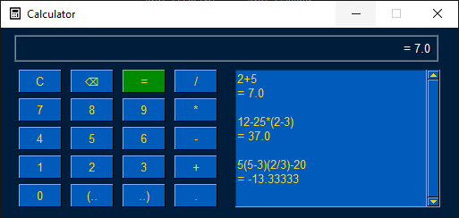

# Calculator
> Simple calculator made with PySimpleGUI, which features addition, subtraction, multiplication, division, order of operations and equations.

## Table of contents
* [General info](#general-info)
* [Screenshots](#screenshots)
* [Technologies](#technologies)
* [Setup](#setup)
* [Features](#features)
* [Status](#status)

## General info
It was made to train Python skills. This calculator features more than every calculator from Youtube etc, it knows the order of operations and equations. The input is veryfied, so if you do something mathicaly uncorrect you will be informed.

## Screenshots

## Technologies
* Python 3.10
* PySimpleGUI 4.60

## Setup
To run this calculator: 
* clone this repository to your computer
* run comand line from the cloned repository path
* if you don't have the PySimpleGUI, type:
>python -m pip install -r requirements.txt
* then type:
>python main.py

## Features
* History of your calculations.
* Order of operations and equations.

## Status
Ready for use.
